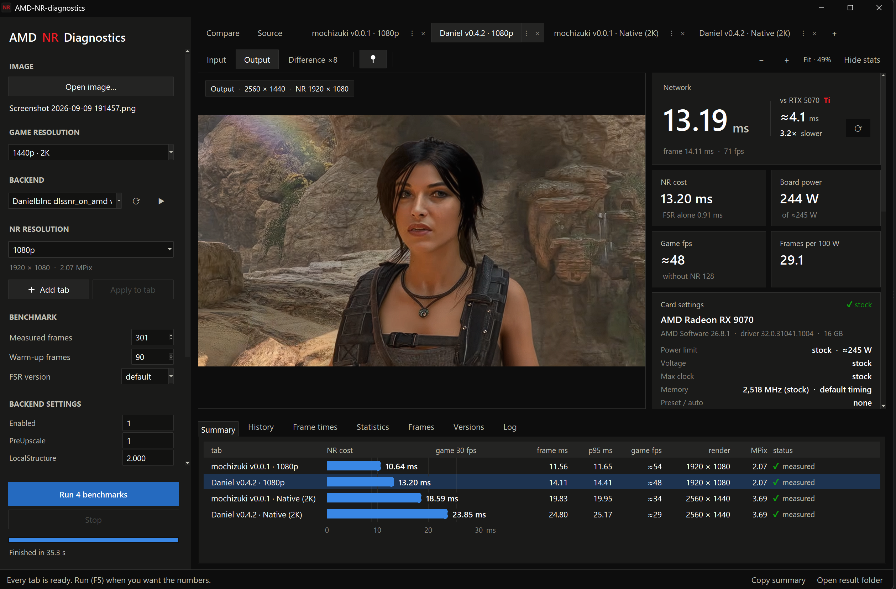

# AMD NR Diagnostics

**Benchmark DLSS 5 neural rendering (NR) on an AMD Radeon card, the way it runs in a real game.**

Give it a screenshot from any game. It plays that frame through a small DirectX 12 game with FSR and
an NR backend loaded, then tells you what the NR costs: frame time, FPS, watts, and frames per 100 W.
You can compare backends, versions and resolutions side by side, and check every picture it makes.

Supported backends:

- **Daniel's DLSS-NR on AMD** (danielblnc), version 0.3.0 and newer
- **mochizuki0323's [DLSSNR-AMD](https://github.com/mochizuki0323/DLSSNR-AMD)**, included with the app

## Why use it

- **Compare results side by side:**
  - **between resolutions:** what Quality, Balanced, Performance or a fixed size costs, on the same frame
  - **between backends and their versions:** Daniel's against DLSSNR-AMD, or one release against the next
  - **image quality across versions:** put two versions' output side by side with the Compare slider, or
    look at the Difference view, to see what a new release changed in the picture
  - **against NVIDIA cards:** your result next to the RTX 5070 Ti's, and the rest of the RTX 50 series
    in the NVIDIA card
- **Find the settings that work best for your PC:** which backend, version and NR resolution give the
  frame rate you want, and which power limit or undervolt gives the most frames per watt. Every run is
  kept in the History chart with the settings it was made at, so you can see what worked best.
- **Keep track of your history and follow each version's progress over time:** every test you run is
  saved, with its backend version, resolution and card settings. The History chart shows all of them at
  once, so you can see how each backend gets faster (or slower) from release to release, filter down to
  one backend, resolution or time period, and find any past run in the list under it.

---

## What you need

- Windows 10 or 11, 64-bit
- An AMD Radeon GPU with a current AMD Software driver
  - Daniel's backend needs an RDNA 3 or RDNA 4 card (RX 7000 / RX 9000)
  - DLSSNR-AMD needs an RX 9000 series card and AMD Software 25.10 or newer
- **`nvngx_dlssnr.dll`** (DLSS 5 NR, version 310.8.0.0), copied from a game that ships DLSS 5. It is
  NVIDIA's file, so it is not included here; every backend builds its model from it.
- For Daniel's backend: his setup files, `dlssnr_on_amd_setup_<version>.exe`, from his releases

## Install

The app is a single exe with everything packed inside. There's no Python, runtime or installer to
set up; nothing gets installed on your system, and everything stays in its own folder.

1. Download the latest zip from the [**Releases**](../../releases/latest) page.
2. Unzip it anywhere, for example `C:\Tools\AMD-NR-diagnostics`.
3. Add your backend files:
   - **Daniel's DLSS-NR on AMD:** copy the setup files (as many versions as you like) and
     `nvngx_dlssnr.dll` into `backends\Danielblnc dlssnr_on_amd\`. You don't run the setups; the app
     reads them itself.
   - **DLSSNR-AMD** is already in `backends\mochizuki\`. It only needs `nvngx_dlssnr.dll`, either in
     that folder or in Daniel's.
4. Run **`AMD-NR-diagnostics.exe`**.

Each backend version you added shows up in the **Backend** list. The first time a backend runs it
builds its model, which takes about a minute, once.

## Your first benchmark

1. **Open image…** (Ctrl+O) and pick a screenshot from a game.
2. Set **Game resolution** to the resolution the game runs at, for example 1440p.
3. The **tabs above the picture** are what gets measured. Each tab is one backend at one NR resolution:
   - **+** adds a tab, or pick a **Backend** and **NR resolution** on the left and press **＋ Add tab**
   - **⋮** on a tab (or right-click it) changes its backend or resolution, runs it alone, or closes it
   - drag a tab to reorder the tabs
4. Press **Run** (F5). The app runs each tab's benchmark and compares it with FSR alone.

The first run at a new resolution can wait up to half a minute while the backend builds its network.
Nothing is measured until that's done.

## Reading the results

| Number | What it means |
|---|---|
| **Latency** | Frame time, with the NR backend running. Lower is better. |
| **vs RTX 5070 Ti** | Next to the main number: the RTX 5070 Ti's DLSS 5 NR time at the same resolution, and how many times slower or faster your card is. **⟳** measures the tab again. |
| **NR cost** | How much time the backend adds to each frame, compared with FSR alone. |
| **Game fps** | Roughly what a real game would reach with NR: a typical game that runs at 100 fps without it. |
| **Board power** | What the whole card drew during the test, read from AMD's driver. |
| **Frames per 100 W** | Efficiency. Useful when you compare different power limits or undervolts. |

Tabs at the bottom of the window:

- **Summary:** every tab side by side
- **History:** a chart of every run you've ever made, with filters for backend, resolution, card
  settings and time, plus the full list of runs underneath
- **Versions:** every backend build the app has seen
- **Frame times / Statistics / Frames / Log:** the detail behind each run

**Compare** (next to the tabs) puts two pictures side by side with a slider, for example two backends'
output at the same resolution. **Copy as text** and **Copy as image** put the result on the clipboard,
ready for a post.

> **Comparing fairly:** your AMD Software settings (power limit, undervolt, clocks) change both speed
> and watts. The app reads them and records them with every result, but never changes them. Only
> compare results taken at the same card settings.

## Where things are

| Folder / file | What's in it |
|---|---|
| `backends\` | Your backend files, one folder per backend. The app never writes here. |
| `out\gui\` | Results of the latest run, plus your run history (`history.json`) |
| `nr_gui_settings.json` | The app's settings |
| `.installed\` | Hidden. The app's own working copy of each backend version; leave it alone. |

To uninstall, delete the folder.

## Troubleshooting

- **A backend isn't in the list:** check its files are in the right `backends\` folder, then press
  **⟳** next to the Backend list.
- **"The game ended" / a backend crashed:** the message quotes the backend's own log line. Pick the
  backend in the list again to restart it.
- **DLSSNR-AMD shows FSR 3.1 instead of FSR 4:** that's expected. It runs through Vulkan
  (vkd3d-proton), where only FSR 3.1 is available. Its FSR-alone baseline runs the same way, so the NR
  cost comparison stays fair.
- **Numbers look off:** look at the **Checks** on the right. They flag a card held at its power limit,
  a busy GPU, heat, and frames that weren't valid.

## Credits

- Daniel's DLSS-NR on AMD by **danielblnc**
- [DLSSNR-AMD](https://github.com/mochizuki0323/DLSSNR-AMD) by **mochizuki0323** (MIT). The shipped
  build also contains vkd3d-proton (LGPL-2.1), DXVK (zlib) and MinHook (BSD-2-Clause); their licences
  are inside its zip.
- AMD FidelityFX SDK and ADLX by AMD
- Nothing from NVIDIA is included: `nvngx_dlssnr.dll` and the model built from it are yours.

## Support

AMD NR Diagnostics is free. Please support the project:

## Disclaimer

This tool is provided as is, without support or warranty of any kind. It is not made by, or affiliated
with, danielblnc, mochizuki0323, NVIDIA or AMD. Use it at your own risk. NVIDIA and DLSS are trademarks
of NVIDIA Corporation; AMD, Radeon, FSR and FidelityFX are trademarks of Advanced Micro Devices, Inc.

## License

Free for personal, non-commercial use. Re-uploading, bundling, selling, modifying and reverse
engineering are not allowed; link to this page instead. Full terms: [LICENSE](LICENSE), also included
in the download as `LICENSE.txt`, with the licences of the third-party parts in its `licenses\` folder.
